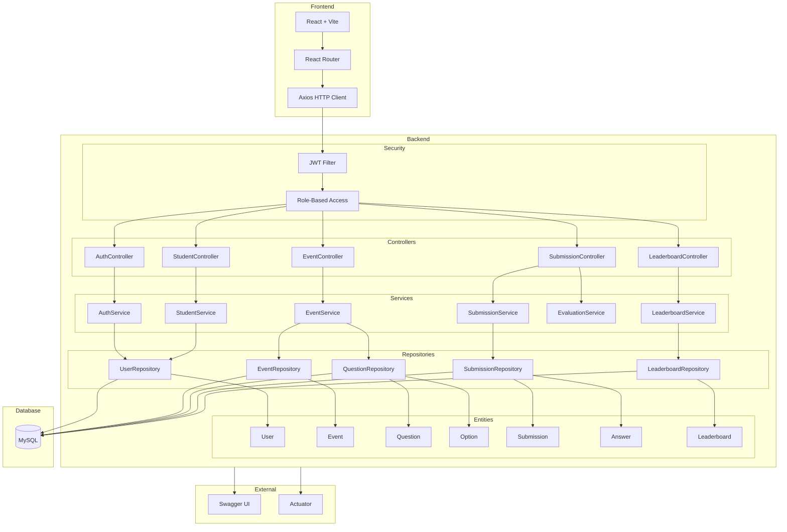

# System Architecture

## Design Pattern: Strategy Pattern for Event Types

The event system uses the **Strategy pattern** because each question type (MCQ, Coding, Debugging, etc.) has distinct validation and scoring logic. By defining a `QuestionHandler` interface and implementing it per type, adding a new category/type requires only:
1. A new enum value in `QuestionType`
2. A new handler class implementing `QuestionHandler`

No existing code needs modification (Open/Closed Principle).
