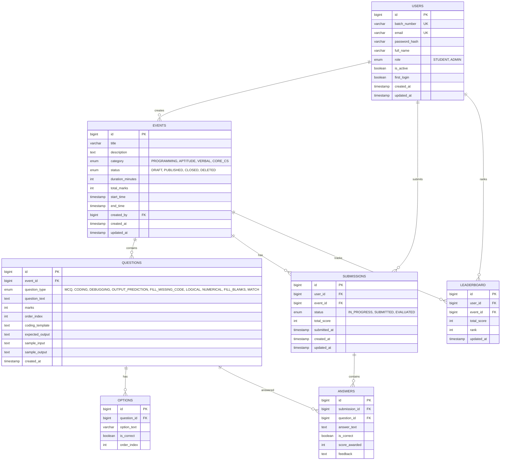

# Entity-Relationship Diagram

## Normalization Notes

- **3NF** throughout: no transitive dependencies, all non-key attributes depend on the primary key
- **No deliberate denormalization** — leaderboard scores are computed and stored for performance but derived from submissions (could be regenerated)
- **Indexes**: batch_number, email (unique), event_id + user_id (submission uniqueness), question_id (answer lookup)
