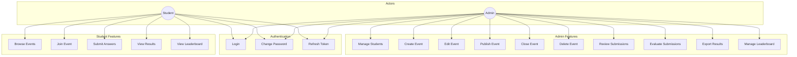

# Use Case Diagram

```mermaid
graph TB
    subgraph Actors
        Student((Student))
        Admin((Admin))
    end

    subgraph Authentication
        UC1[Login]
        UC2[Change Password]
        UC3[Refresh Token]
    end

    subgraph Student Features
        UC4[Browse Events]
        UC5[Join Event]
        UC6[Submit Answers]
        UC7[View Results]
        UC8[View Leaderboard]
    end

    subgraph Admin Features
        UC9[Manage Students]
        UC10[Create Event]
        UC11[Edit Event]
        UC12[Publish Event]
        UC13[Close Event]
        UC14[Delete Event]
        UC15[Review Submissions]
        UC16[Evaluate Submissions]
        UC17[Export Results]
        UC18[Manage Leaderboard]
    end

    Student --> UC1
    Student --> UC2
    Student --> UC3
    Student --> UC4
    Student --> UC5
    Student --> UC6
    Student --> UC7
    Student --> UC8

    Admin --> UC1
    Admin --> UC2
    Admin --> UC3
    Admin --> UC9
    Admin --> UC10
    Admin --> UC11
    Admin --> UC12
    Admin --> UC13
    Admin --> UC14
    Admin --> UC15
    Admin --> UC16
    Admin --> UC17
    Admin --> UC18
```
